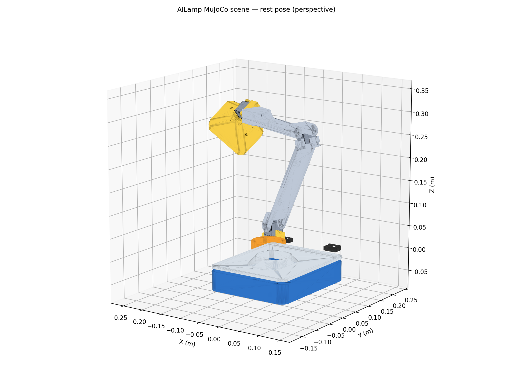
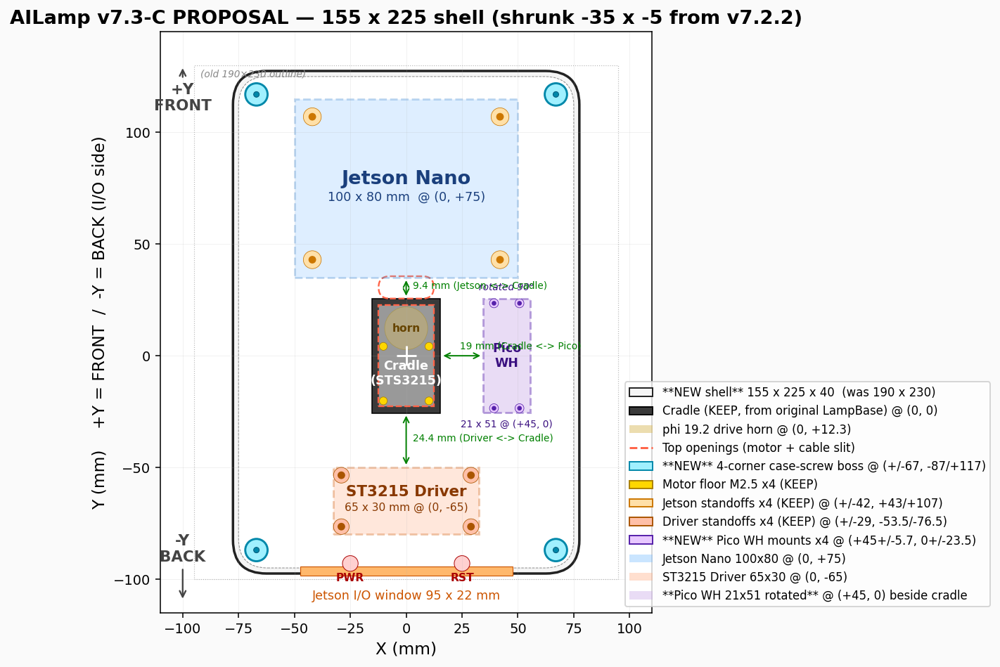

# AILamp

> Vision + voice reactive desk lamp on Jetson Nano + Raspberry Pi Pico W. 5-DOF ST3215 arm, LiveKit/OpenAI Realtime voice agent, MuJoCo simulation. Fork of [LeLamp](https://github.com/humancomputerlab/LeLamp).

[](LICENSE)
[](pyproject.toml)
[](simulation/ailamp_scene.xml)
[](ailamp_runtime/ailamp/agent/livekit_agent.py)



AILamp is a Jetson-based interactive robotic lamp built from the LeLamp mechanical and motion foundation. It integrates MuJoCo simulation, virtual vision, local person detection, ST3215 servo control, Pico WH LED control, USB audio, and OpenAI/LiveKit voice interaction.

## Modeling and Simulation Toolchain

AILamp keeps the same toolchain as the upstream LeLamp repository:

- Mechanical CAD: OnShape.
- 3D print exchange files: original LeLamp `.3mf` files in `3D/` plus generated AILamp adapter files in `3D/AILamp_Adapters/`.
- Mesh assets for simulation: `.stl` files in `simulation/assets/`.
- Robot simulation: MuJoCo MJCF XML, with `simulation/ailamp_scene.xml` as the AILamp scene.
- Reference robot description: `simulation/robot.urdf` is kept with the upstream assets.

Do not make Blender, Gazebo, Isaac Sim, SolidWorks, or Fusion 360 the primary project workflow unless the team explicitly changes this toolchain.

## Hardware Profiles

The full non-printed hardware BOM is the structured `[hardware_bom]` section in the active profile config. Use `config/hardware.toml` for Orin Nano Super and `config/hardware.jetson-nano.toml` for Jetson Nano 4GB. `docs/en/0-prerequisites.md` mirrors both profiles for purchasing. This includes Jetson, storage or microSD boot media, ST3215 servos, Waveshare servo driver, both MEAN WELL power supplies, Pico WH, NeoMatrix, TXS0108E, Arducam UB0234, ReSpeaker XVF3800, Seeed 4 ohm 5W speaker, emergency switch, USB cables, servo extensions, DC barrel adapters, WAGO connectors, and wire.

Two controller profiles are provided:

- `config/hardware.toml`: Orin Nano Super profile with local YOLO person/pose detection.
- `config/hardware.jetson-nano.toml`: Jetson Nano 4GB API-hybrid profile. It keeps motor, LED, camera, and voice behavior but does not run MuJoCo, local YOLO pose, or local large models on the Nano.

## Project Layout

```text
AILamp/
  3D/                         LeLamp .3mf files and AILamp adapter kit
  3D/AILamp_Adapters/         Generated .3mf print files and .stl exports
  simulation/                 MuJoCo MJCF model, STL assets, AILamp scene
  firmware/pico_led_controller/
  ailamp_runtime/ailamp/      Python runtime package
  config/hardware.toml        Orin Nano Super hardware and runtime config
  config/hardware.jetson-nano.toml
  docs/en/                    English build guide
  docs/zh/                    Chinese build guide
  tests/                      Local unit tests
```

## 3D Print Files

The seven upstream LeLamp `.3mf` files are kept unchanged for reference. The Jetson Nano hidden-electronics profile uses generated replacement base parts under `3D/AILamp_Adapters/`: `AILamp_LampBase_Electronics_Shell.3mf` replaces `LampBase.3mf`, and `AILamp_LampBase_Electronics_Cover.3mf` replaces `LampBase - Cover.3mf`. The replacement shell scales the original LampBase outer form and keeps the arm-origin relationship; it is not a second base stacked under the original. Bench-fit tray/deck files and cable clips are also included for staged hardware testing. Print the replacement base at low infill first for fit testing before a final print.

Adapter files are generated by `scripts/generate_ailamp_adapters.py`. The local tests verify that checked-in adapter files match fresh generation and that the generated 3MF meshes are closed 2-manifold meshes.

Current revision **v7.3-C.1** packs Jetson Nano, ST3215 driver, Pico WH, and the original LeLamp servo cradle into a 155 × 225 × 40 mm integrated base. The internal layout, with vent slots, four-corner cover screws, and the restored cable slit, is shown below.



## Setup

```bash
git clone https://github.com/YuGu0358/AILamp.git
cd AILamp
python3 -m venv .venv
source .venv/bin/activate
pip install -e ".[test]"
```

For Jetson hardware:

```bash
pip install -e ".[hardware,voice]"
```

For Jetson Nano 4GB API-hybrid mode:

```bash
pip install -e ".[nano]"
export OPENAI_API_KEY=...
ailamp --config config/hardware.jetson-nano.toml hardware-check
```

For physical ST3215 playback and calibration, install the upstream LeLamp runtime beside AILamp:

```bash
cd ..
git clone https://github.com/humancomputerlab/lelamp_runtime.git
cd AILamp
python3 -m pip install -e ../lelamp_runtime
```

For MuJoCo simulation:

```bash
pip install -e ".[simulation]"
```

## CLI

```bash
ailamp runtime-check
ailamp --config config/hardware.jetson-nano.toml runtime-check --include-devices --include-voice
ailamp hardware-check
ailamp hardware-check --include-devices
ailamp hardware-check --failures-only
ailamp motor-test
ailamp led-test
ailamp camera-test
ailamp audio-test
ailamp birthday-check --today 2026-05-08 --dry-run
ailamp sim-check
ailamp sim-check --render outputs/sim_check.png
ailamp sim-demo
ailamp sim-viewer --render outputs/model.png
ailamp vision-demo
ailamp vision-loop --frames 30
ailamp vision-loop --with-outputs
ailamp agent-tools-test --event person_close --apply
ailamp agent-tools-test --event posture_studying --apply
ailamp agent-tools-test --event person_right --offset 0.6 --request "看着我并跟随我" --apply
ailamp --config config/hardware.jetson-nano.toml agent-tools-test --event person_right --offset 0.6 --request "看着我并跟随我" --apply
ailamp agent
ailamp agent --with-outputs
```

`vision-loop` is the real camera-to-behavior bridge. With the Orin profile it reads the Arducam UB0234 camera, runs YOLO person and pose detection, writes the current state to `outputs/vision_state.json`, and maps the event to a motion and LED color. With the Jetson Nano profile it sends low-rate camera frames to OpenAI vision and reuses the latest semantic event between API calls. Add `--with-outputs` only on the Jetson after motor and LED tests pass; that flag drives the ST3215 servos and Pico WH LED controller.

`ailamp agent` reads the same vision state file, so OpenAI/LiveKit tools can report the current vision state, suggest the matching motion/light response, or apply that response to the physical outputs.

Use `agent-tools-test` to validate the AI-callable decision layer without LiveKit or hardware. It defaults to dry-run outputs; add `--with-outputs` only on the Jetson after hardware tests pass. The decision layer can combine vision state and voice intent, including continuous tracking commands such as `base_yaw` left/right and `wrist_pitch` forward/back.

## Verification

Run the local project check before pushing changes:

```bash
scripts/verify_local.sh
```

The script runs unit tests, lockfile validation, static hardware checks, wheel build, whitespace checks, and MuJoCo smoke tests when the sibling `mujoco_mcp` environment is present.

`docs/github-actions-ci.yml` contains the matching GitHub Actions template. Copy it to `.github/workflows/ci.yml` when pushing with a GitHub credential that has `workflow` scope.

## Documentation

- English guide: `docs/en/`
- Chinese guide: `docs/zh/`

## Attribution

AILamp copies 3D print files, MuJoCo/URDF simulation assets, and motion recording CSV files from Human Computer Lab's LeLamp projects. See `NOTICE.md` and `LICENSE`.
